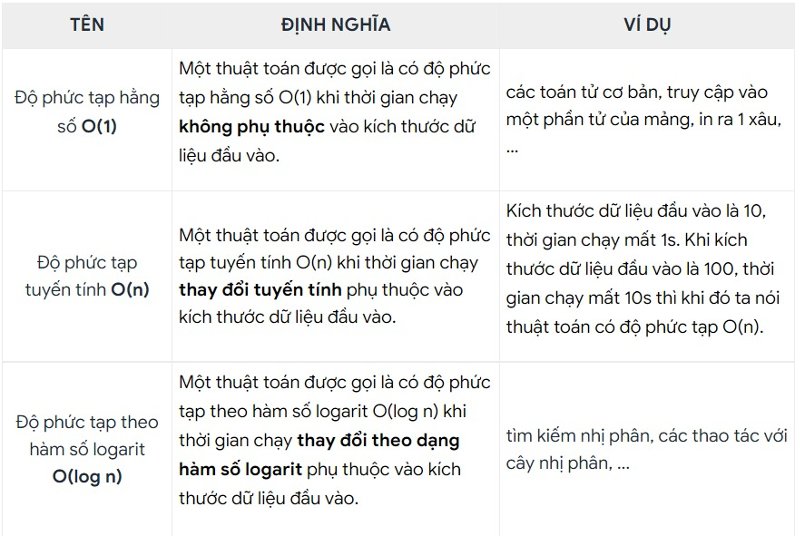

# Độ phức tạp thời gian BigO là gì?

## Khái niệm thời gian chạy của chương trình

- Thời gian chạy của chương trình là quãng thời gian mà máy tính cần để thực hiện toàn bộ những yêu cầu mà người dùng đặt ra.

## Khái niệm về độ phức tạp thời gian

### Độ phức tạp thời gian

- Độ phức tạp thời gian là toàn bộ tài nguyên về thời gian mà máy tính cần để thực thi một thuật toán nào đó, được thể hiện bằng hàm số `y = f(x)`.

- Trên thực tế, do sự khác biệt về dữ liệu đầu vào như đã nói ở trên, đa phần các thuật toán sẽ được tính toán độ phức tạp dựa vào trường hợp xấu nhất (worst-case), tức là khoảng thời gian tối đa mà chương trình sẽ chạy với một bộ dữ liệu có kích thước cố định. Một số thuật toán sẽ được đánh giá dựa theo trường hợp trung bình (average-case) ví dụ như Quick Sort. Để biết tại sao Quick Sort lại được đánh giá dựa vào trường hợp trung bình thì hãy tiếp tục theo dõi khoá học này nhé.
- Ngoài ra còn có một cách đánh giá dựa vào trường hợp tốt nhất (best-case). Tuy nhiên, ta sẽ không quan tâm đến cách đánh giá này do nó không bao giờ được áp dụng trong thực tế.

<b>
Tuy nhiên, do các hàm số thể hiện độ phức tạp thường rất khó tính toán nên chúng ta cần một phương pháp đánh giá hiệu quả hơn. Một cách được sử dụng phổ biến đó là Độ phức tạp thời gian BigO.
</b>

### Độ phức tạp thời gian BigO

- Độ phức tạp thời gian BigO (Big O notation) thể hiện sự thay đổi của độ phức tạp thời gian phụ thuộc vào sự thay đổi của dữ liệu đầu vào.

#### Một số độ phức tạp thời gian cơ bản

## Cách đánh giá độ phức tạp của thuật toán

- Để đánh giá độ phức tạp của một thuật toán không đệ quy có thể tóm gọn lại như sau:

1. Tính `số lần lặp tối đa` của một vòng lặp
2. Nếu các vòng lặp `nối tiếp nhau` thì `cộng` số lần lặp tối đa của các vòng lặp với nhau
3. Nếu các vòng lặp `lồng nhau` thì `nhân` số lần lặp tối đa của các vòng lặp với nhau
